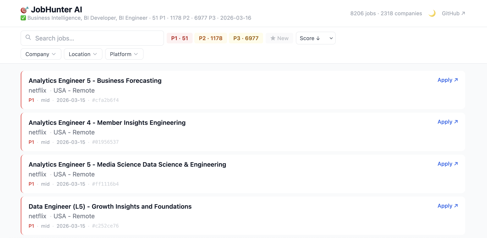

<p align="center">
  
</p>

<h1 align="center">🎯 JobHunter AI</h1>

<p align="center">
  <strong>Stop scrolling job boards.</strong><br>
  Tell Claude what you're looking for — it searches 502,000+ jobs, scores every match, and gets your resume ready to send.
</p>

<p align="center">
  <a href="https://adityamujumdar.github.io/job-finder">🔗 Live Dashboard</a> · <a href="https://claude.ai/code">🤖 Get Claude Code</a> · <a href="#get-started-5-minutes">⚡ Install in 5 min</a>
</p>

---

## How It Works

Every time you run it, JobHunter searches over **half a million job listings** from 12,000+ companies, scores each one against your background, and shows you a ranked dashboard:

| Priority | Meaning | Action |
|---|---|---|
| 🔴 **P1** | Strong match | Apply today |
| 🟠 **P2** | Good match | Apply this week |
| 🟡 **P3** | Decent match | If you have time |

Then Claude helps you act on the best ones — classify which to apply to first, and build a tailored resume for any job in 30 seconds.

---

## Get Started (~5 minutes)

> 🤖 **You'll need [Claude Code](https://claude.ai/code)** — requires a Claude Pro or Max subscription ($20+/month).

### Step 1 — Open Claude Code and paste this

```
git clone https://github.com/adityamujumdar/job-finder.git ~/job-finder 2>/dev/null || (cd ~/job-finder && git pull); cd ~/job-finder && ./setup
```

Claude installs everything, registers the skills, then asks what kind of jobs you're looking for:

```
╔══════════════════════════════════════════════════════════════════╗
║  Claude Code                                                      ║
╠══════════════════════════════════════════════════════════════════╣
║                                                                  ║
║  ✅ JobHunter AI is ready!                                       ║
║                                                                  ║
║  💡 Type /jobhunter to start your job search!                    ║
║                                                                  ║
║  You: /jobhunter                                                 ║
║                                                                  ║
║  Claude: Hi! I'll help you find jobs. Let me set up your        ║
║          profile first.                                          ║
║                                                                  ║
║          What kind of roles are you looking for?                 ║
║                                                                  ║
║  You: Software Engineer, Backend Engineer                        ║
║                                                                  ║
║  Claude: Where are you based?                                    ║
║                                                                  ║
║  You: Austin, TX — open to remote and SF                        ║
║                                                                  ║
║  Claude: ✅ Profile saved. Searching 502K jobs...               ║
║                                                                  ║
║          🎯 Found 23 P1 jobs — apply today!                     ║
║             + 156 P2 matches worth applying this week            ║
║                                                                  ║
╚══════════════════════════════════════════════════════════════════╝
```

> **You don't need to edit any config files.** Claude handles everything.

### Step 2 — See Your Dashboard

Claude opens `site/index.html` in your browser — search, filter by priority, click **Apply ↗** to go straight to the job page.

---

## What You Can Do

Once set up, just talk to Claude:

### 🔍 Find new jobs
```
/jobhunter
```
Searches 502K+ listings, scores them, builds your dashboard.

### 📋 Decide what to apply to
```
/classify-jobs
```
Sorts your top matches into **APPLY NOW · THIS WEEK · STRETCH · SKIP**.

### 📄 Tailor a resume
```
/tailor-resume
build a resume for job #a3f9c1d2
```
Copy a job ID from the dashboard → Claude builds a job-specific resume → `Cmd+P` → PDF.

### 💬 Ask anything
```
"Which P1 jobs should I apply to first?"
"What's missing from my background for the Stripe role?"
"Add React to my skills and re-run the search"
```

---

## Automatic Daily Updates

Have the dashboard refresh every morning — no manual runs needed.

**1.** Push to your GitHub:
```bash
cd ~/job-finder
git remote set-url origin https://github.com/YOUR-USERNAME/job-finder.git
git push -u origin main
```

**2.** GitHub → **Settings** → **Pages** → **Source: GitHub Actions** → Save

Your dashboard updates at **6am UTC daily** at `https://YOUR-USERNAME.github.io/job-finder`

---

## How Scoring Works

| Factor | Weight | Example |
|---|---|---|
| Job title match | 35% | "Senior Software Engineer" ↔ "Software Engineer" |
| Location match | 20% | Remote-OK scores high if you're remote-open |
| Seniority level | 15% | "Senior" matches 4+ years experience |
| Keyword match | 15% | Python, Go, distributed systems |
| Preferred companies | 10% | Stripe, Anthropic, Linear get a boost |
| Recency | 5% | New listings score slightly higher |

**P1** = 85–100 · **P2** = 70–84 · **P3** = 50–69

---

## FAQ

<details>
<summary><strong>Do I need to know how to code?</strong></summary>
Not at all. You paste one line into Claude Code and it handles everything.
</details>

<details>
<summary><strong>Is this free?</strong></summary>
Job data is open-source and GitHub hosting is free. Claude Code requires a Pro or Max subscription ($20+/month).
</details>

<details>
<summary><strong>Will it find jobs in my field?</strong></summary>
Yes — Claude sets up your profile around your target roles. A designer will see design jobs; a PM will see PM jobs. If results aren't great, tell Claude: <em>"Help me tune my profile."</em>
</details>

<details>
<summary><strong>Is my resume private?</strong></summary>
Yes. Your resume (<code>RESUME.md</code>) stays on your computer and is never uploaded anywhere.
</details>

<details>
<summary><strong>My results aren't great. What do I do?</strong></summary>
Tell Claude: <em>"I'm getting mostly P3 jobs. Can you help me tune my profile?"</em>
</details>

---

<details>
<summary><strong>📐 Technical Details</strong></summary>

### Architecture

```
DAILY PIPELINE (GitHub Actions, 6am UTC)
────────────────────────────────────────

  src/downloader.py     Download 502K jobs from job-board-aggregator (~15s)
         ↓
  src/scraper.py        Merge + deduplicate + clean
         ↓
  src/matcher.py        Score every job against profile.yaml (~8s)
         ↓
  src/report.py         CSV report + terminal summary
         ↓
  src/site_generator.py Build the HTML dashboard
         ↓
  GitHub Pages          Deployed automatically
```

### ATS Platforms

Greenhouse · Lever · Workday · Ashby · BambooHR — 12,000+ companies.

### File Structure

```
job-finder/
├── config/profile.yaml          # Your preferences
├── src/                         # Python pipeline
│   ├── scraper.py               # Orchestrator
│   ├── matcher.py               # Scorer
│   ├── report.py                # CSV + terminal output
│   └── site_generator.py        # Dashboard builder
├── jobhunter/SKILL.md           # /jobhunter skill
├── classify-jobs/SKILL.md       # /classify-jobs skill
├── tailor-resume/SKILL.md       # /tailor-resume skill
├── RESUME.md                    # Your resume (gitignored)
└── .github/workflows/daily.yml  # Cron pipeline
```

### Manual Pipeline

```bash
source .venv/bin/activate
python -m src.scraper           # Download + merge (~25s)
python -m src.matcher           # Score + rank (~8s)
python -m src.report            # CSV report
python -m src.site_generator    # Build dashboard
open site/index.html
```

</details>

---

## Credits

Built on [job-board-aggregator](https://github.com/Feashliaa/job-board-aggregator) (MIT) — the open-source dataset that makes 502K+ daily jobs possible.

## License

[MIT](LICENSE) — Fork it, customize it, share it.

---

<p align="center">
  <em>If this helps you land a role, star the repo ⭐</em>
</p>
